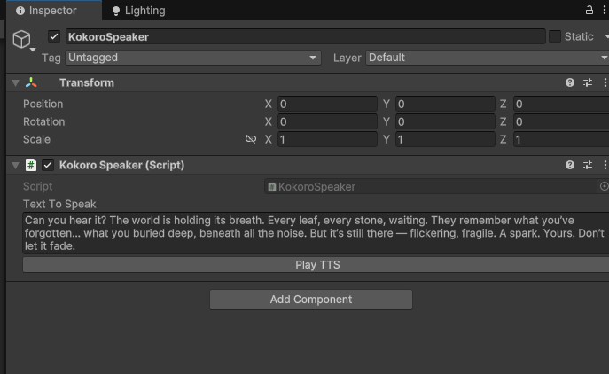

# kokoro4unity
A KokoroSharp component to use high quality offline TTS inside Unity

## How it works?
- A Kokoro C# named pipe server is started as a process
- Contract .dll is used to Unity can talk to the process in memory
- Issue TTS requests to the process from Unity as a method call

## Details
Playing around with the great project https://github.com/Lyrcaxis/KokoroSharp I quickly noticed that it wouldn't be possible tu use the nuget library directly into unity.
The solution to this problem was to create a separate process (KokoroServer) that uses a named pipe.

Named pipe works similar to a http server, with the difference that instead of having the network protocol / traffic overhead, it allows two independent applications to communicate directly via memory, which is really fast.

# How to use
- Add the KokoroSpeaker component in any GameObject of your preference

- Start KokoroServer (at the moment you need to compile it yourself using Rider or VS)
- Click the button PlayTTS to test is

# Notes
- It works well but there might have some bugs as I put it together quickly
- Great opportunity to have offline TTS of high quality into Unity